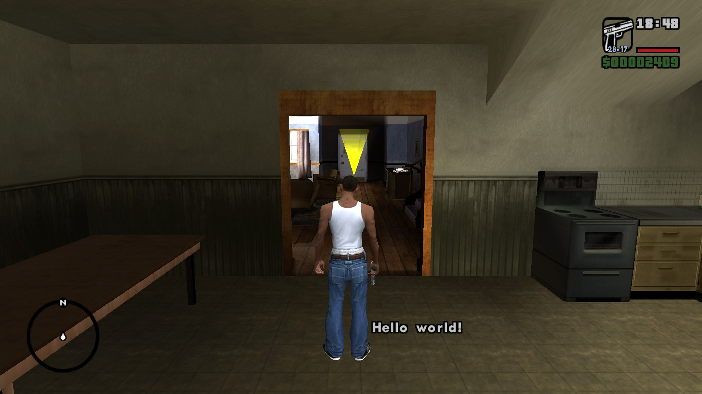

If you want to display a simple message to the player in the center of the screen, run `PRINT_STRING_NOW`.

```sc 
PRINT_STRING_NOW "My special message" 1000
```

**Syntax:** 
```sc 
PRINT_STRING_NOW "<MESSAGE>" <TIME>
```

`MESSAGE [string]`: The string you want to show.

`TIME [int]`: For how long you want the message to show up for (in millisseconds).



**Full Example:** 

```sc
// simple-print.hb-mods.sc

SCRIPT_START
{
  NOP

  main_loop:
  WAIT 0
  PRINT_STRING_NOW "Hello world!" 1000
  GOTO main_loop
}
SCRIPT_END
```

# References

## Commands

1. [PRINT_STRING_NOW - SannyBuilder](https://library.sannybuilder.com/#/sa/script/extensions/CLEO/0ACD)

## Sources

1. [Text - GTAMods Wiki](https://gtamods.com/wiki/Text#Mission_script)