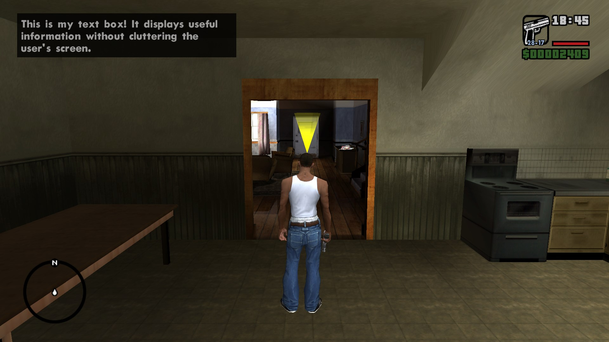

If instead you wish do display a message on the top left corner of the screen (called a help message), use PRINT_HELP instead:

```sc
ADD_TEXT_LABEL TXTBOX1 "Hello text box!"
PRINT_HELP TXTBOX1
```





* [ ] Dick

### Full Example:

```sc
// text-box.hb-mods.sc

SCRIPT_START
{
  NOP

  WAIT 0
  ADD_TEXT_LABEL TXTBOX1 "This is my text box! It displays useful information without cluttering the user's screen."
  SET_HELP_MESSAGE_BOX_SIZE 350   // Sets the text box width
  PRINT_HELP TXTBOX1              // Prints the message
  WAIT 6900                       // Waits 6900 millisseconds before clearing the message
  CLEAR_HELP                      // Clears the text box message
}
SCRIPT_END
```

# References

## Commands

1. [PRINT_HELP - Sanny Builder](https://library.sannybuilder.com/#/sa/script/extensions/default/03E5): 
2. [CLEAR_HELP - Sanny Builder](https://library.sannybuilder.com/#/sa/script/extensions/default/03E6): 
3. [SET_HELP_MESSAGE_BOX_SIZE - Sanny Builder](https://library.sannybuilder.com/#/sa/script/extensions/default/0989): 

# Sources

1. [Text - GTAMods Wiki](https://gtamods.com/wiki/Text#Mission_script)

{/* ## Cards

<Cards>
  <Card title="Learn more about Next.js" href="https://nextjs.org/docs" />
  <Card title="Learn more about Fumadocs" href="https://fumadocs.dev" />
</Cards> */}